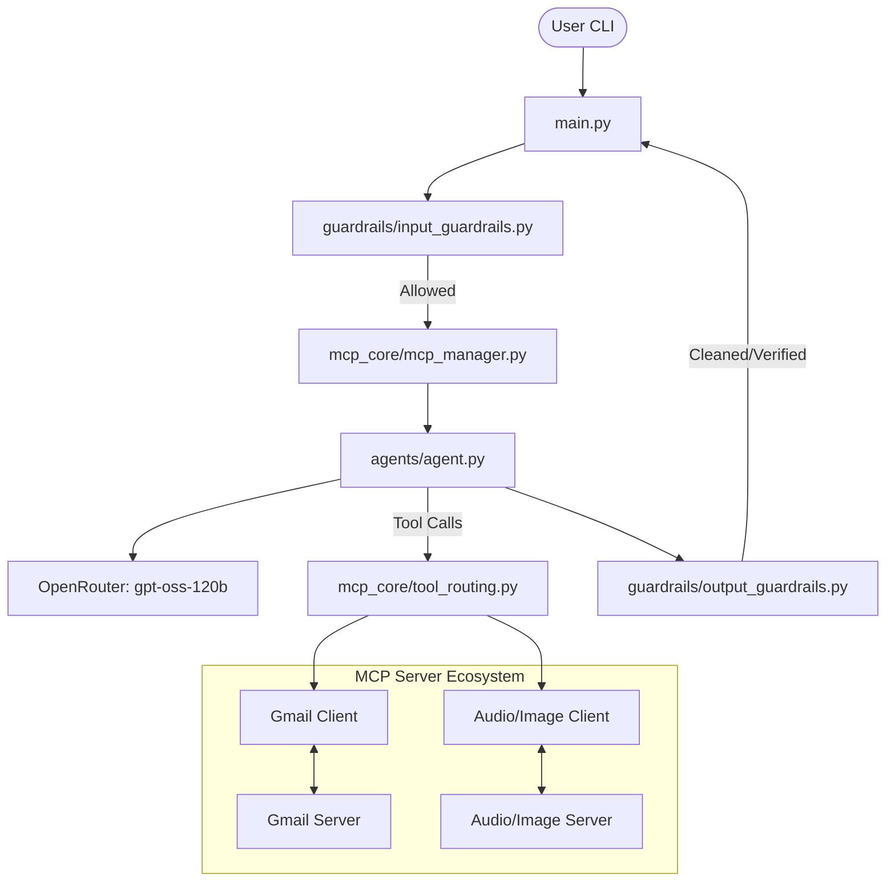

# Project Overview & AI Guide (`claude.md`)

This document serves as an architectural guide and system description of the MCP-based LangChain Agent project for developers and AI assistants.

---

## System Architecture

The project is a conversational AI agent built with **LangChain**, utilizing **Model Context Protocol (MCP)** to communicate with local services (Gmail, Audio/Image processing) acting as MCP servers.



---

## Detailed Directory Structure

- **`main.py`**: The application entry point. Handles the interactive CLI chat loop, user input validation, MCP server manager context setup, and coordinates the execution between the user, guardrails, and agent runner.
- **`agents/`**
  - **`agent.py`**: Configures the LLM (`openai/gpt-oss-120b:free` via OpenRouter), binds the active tools, and implements the agent reasoning loop. If the model issues a tool call, it executes it via the `ToolRouter`. Outputs (both final LLM responses and intermediate audio transcript tool results) are vetted by the output guardrails.
- **`guardrails/`**
  - **`input_guardrails.py`**: Performs regex-based checks on user inputs to block hateful speech, prompt injection attempts, or specific banned instructions.
  - **`output_guardrails.py`**: Vets responses generated by the assistant or retrieved from audio transcripts for hateful content and prompt injection.
- **`mcp_core/`**
  - **`mcp_manager.py`**: An asynchronous context manager (`MCPManager`) that initializes and tears down registered MCP clients.
  - **`tool_routing.py`**: A helper class (`ToolRouter`) that maps tool names to their corresponding active client sessions and executes them.
  - **`mcp_clients/`**:
    - `gmail_mcp_client.py`: Spawns the stdio-based Gmail FastMCP server process.
    - `audio_image_client.py`: Spawns the stdio-based Audio/Image FastMCP server process.
  - **`mcp_servers/`**:
    - `gmail_server.py`: FastMCP server that connects to Gmail using `imaplib` (for reading and searching) and `smtplib` (for sending and drafting emails).
    - `image_audio_server.py`: FastMCP server providing image analysis placeholders (base64 image URI formatting) and audio transcription tools.
  - **`internal_tools/`**:
    - `audio_model.py`: Backend transcription model using `faster_whisper.WhisperModel` running on CPU (`int8`).
- **`github_client.py`**: Legacy file containing LangChain `@tool` definitions for various GitHub Actions (branch, issue, PR, workflow, file, and repository management). *Note: These tools are currently inactive and not integrated into the main agent CLI.*
- **`system_prompt.py`**: Houses the system guidelines and tool descriptions injected into the agent.

---

## Key Execution Flows

### 1. Request / Response Lifecycle

1. **Input Reception**: `main.py` reads user input from the terminal.
2. **Input Guardrail**: `verify_user_input()` parses the raw string.
   - If blocked (e.g., hate speech, injection), the query is rejected, and an explanation is displayed.
   - If allowed, the prompt is normalized to lowercase.
3. **Agent Activation**: `run_agent()` receives the prompt along with the tools and tool mapping.
4. **Reasoning Loop**:
   - The LLM (`gpt-oss-120b`) evaluates the conversation history and decides whether to output text or make a tool call.
   - If a tool call is requested:
     - The `ToolRouter` directs the call to the appropriate MCP client session.
     - The tool executes inside the sub-process (e.g., `gmail_server.py`).
     - The tool output is captured. If it is an audio transcript, it is run through `verify_assistant_output()` first.
     - The result is appended to the message history, and the LLM is invoked again.
   - If a final text response is produced:
     - The response is validated by `verify_assistant_output()`.
     - If safe, the response is returned to `main.py` and printed.

### 2. MCP Server Communication Flow

```
+-----------+                    +------------------+                   +--------------------+
|  Agent    | -- tool call ----> |    ToolRouter    | -- call_tool ---> |     MCP Client     |
| (agent.py)|                    | (tool_routing.py)|                   | (e.g. GmailClient) |
+-----------+                    +------------------+                   +--------------------+
                                                                                  |
                                                                              (stdio)
                                                                                  v
+-----------+                                                           +--------------------+
|  Response | <--- stdout/json ---------------------------------------- |     MCP Server     |
+-----------+                                                           | (e.g. gmail_server)|
```

---

## Current Status & Discrepancies

When working on or debugging the project, keep the following quirks in mind:

1. **GitHub Tools (`github_client.py`)**:
   - Although defined as LangChain `@tool` decorators and heavily described in `system_prompt.py`, these tools are **not** loaded in `main.py` or wrapped in MCP.
   - **Do not** attempt to call them unless they are explicitly imported and bound to the agent.
2. **Mathematical Tools**:
   - The `system_prompt.py` and the original `README.md` list mathematical tools (`add`, `subtract`, `multiply`, `divide`). 
   - No such tools are currently implemented or exposed in the code.
3. **Audio Transcription Backend (`image_audio_server.py` vs `audio_model.py`)**:
   - The `faster_whisper` imports in `image_audio_server.py` are commented out, and `audio_to_text` returns a dummy text string (`"transcribe_file(audio_path)"`).
   - However, a functional CPU-based Whisper transcriber is available in `mcp_core/internal_tools/audio_model.py`.
4. **Environment Configuration**:
   - Ensure a `.env` file exists with `OPENROUTER_API_KEY`, `GMAIL_ADDRESS`, and `GMAIL_APP_PASSWORD`.
   - If GMail authentication credentials are not set, the Gmail MCP server will fail to start.
